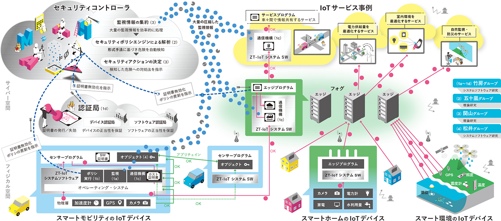

[\[English\]](https://zt-iot.nii.ac.jp/en/)

<table>
  <tr>
    <td> <a href="#topics">Topics</a></td>
    <td> <a href="#overview">研究概要</a></td>
    <td> <a href="#member">メンバー</a></td>
    <td> <a href="#publications">研究業績</a></td>
  </tr>
</table>

# 形式検証とシステムソフトウェアの協働によるゼロトラストIoT
JST CREST研究領域：[基礎理論とシステム基盤技術の融合によるSociety 5.0のための基盤ソフトウェアの創出 (S5基盤ソフト)](https://www.jst.go.jp/kisoken/crest/research_area/ongoing/bunya2021-2.html)

## 公募情報
* 2022/07/19 [（NIIシステムグループ）特任研究員（特定有期雇用職員・ポスドク相当）【JST CREST 形式検証とシステムソフトウェアの協働によるゼロトラストIoT】 募集](https://www.nii.ac.jp/about/recruit/2022/0719.html)

## Topics
* 2022/11/01 11/14-17に[SC22](https://sc22.supercomputing.org/)の展示会場(Booth# 4205)で本ブロジェクトの展示発表を行います． [PDF](https://drive.google.com/file/d/1SXcRYDSkcyxqTAewuJm5YerkvJG_13ss/view?usp=sharing) 
* 2021/09/21 [2021年度 戦略的創造研究推進事業 (CREST)，研究領域「基礎理論とシステム基盤技術の融合によるSociety 5.0のための基盤ソフトウェアの創出 (S5基盤ソフト)」に採択されました．](https://www.jst.go.jp/kisoken/crest/application/2021/210921/210921crest.pdf)

## 研究概要
形式検証とシステムソフトウェアの融合により、ゼロトラスト(ZT)の概念を踏襲した安全なIoTシステムを実現します。理論研究では、IoTのトラストチェーンの正当性に数学的証明を与え、動的検証の併用で未知の脅威にも対応します。システムソフト研究では理論的成果と連係して実行隔離・自動検知・自動対処機構を開発し，ZT-IoTを実証します。アカウンタビリティを保証することでIoTの社会受容を促進します。

## メンバー

NIIシステムソフトウェアグループ

<table>
  <tr>
    <td>
      <b>研究代表者</b> 
      <a href="https://researchmap.jp/takefusa"> 竹房 あつ子</a> 
      <a href="https://www.nii.ac.jp/">国立情報学研究所</a> アーキテクチャ科学研究系 教授
    </td>
  </tr>
 
 <tr>
    <td>
	<a href="https://researchmap.jp/yutaka_ishikawa">石川 裕</a> 
	国立情報学研究所 アーキテクチャ科学研究系 教授
    </td>
  </tr>
 
 <tr>
    <td>
	<a href="https://researchmap.jp/aida?lang=ja">合田 憲人</a> 
	国立情報学研究所 アーキテクチャ科学研究系 教授
    </td>
  </tr>

 <tr>
    <td>
	<a href="https://researchmap.jp/smzs?lang=ja">清水 さや子</a> 
	国立情報学研究所 アーキテクチャ科学研究系 助教
    </td>
  </tr>

 <tr>
    <td>
	<a href="https://researchmap.jp/7000026496?lang=ja">北川 直哉</a> 
	国立情報学研究所 学術ネットワーク研究開発センター 特任准教授
    </td>
  </tr>

 <tr>
    <td>
	<a href="https://researchmap.jp/kobayashikumiko?lang=ja">小林 久美子</a> 
	国立情報学研究所 クラウド基盤研究開発センター 特任研究員
    </td>
  </tr>

 <tr>
    <td>
	<a href="https://researchmap.jp/sakaneeisaku?lang=ja">坂根 栄作</a> 
	国立情報学研究所 アーキテクチャ科学研究系 准教授
    </td>
  </tr>
	
 <tr>
    <td>
	<a href="https://researchmap.jp/nishimuratakeshi?lang=ja">西村 健</a> 
	国立情報学研究所 学術基盤推進部 特任研究員
    </td>
  </tr>
	
 <tr>
    <td>
	<a href="">YIN, Jie</a> 
	国立情報学研究所 アーキテクチャ科学研究系 特任研究員
    </td>
  </tr>
	
 <tr>
    <td>
	<a href="">青木 信雄</a> 
	国立情報学研究所 アーキテクチャ科学研究系 RA
    </td>
  </tr>
</table>

京大理論グループ

<table>
  <tr>
    <td>
	<b>主たる共同研究者</b> 
	<a href="https://researchmap.jp/Atsushi.Igarashi?lang=ja"> 五十嵐 淳</a> 
	<a href="https://www.i.kyoto-u.ac.jp">京都大学 大学院情報学研究科</a> 教授
    </td>
  </tr>

  <tr>
    <td>
	<a href="https://researchmap.jp/ksuenaga?lang=ja">末永 幸平</a> 
	京都大学 大学院情報学研究科 准教授
    </td>
  </tr>

  <tr>
    <td>
	<a href="https://researchmap.jp/mwaga?lang=ja">和賀 正樹</a> 
	京都大学 大学院情報学研究科 助教
    </td>
  </tr>

  <tr>
    <td>
    稲葉 皓信  
    京都大学 大学院情報学研究科 通信情報システム専攻 大学院生 (修士課程)
    </td>
  </tr>

  <tr>
    <td>
    SHI, Zhen  
    京都大学 大学院情報学研究科 通信情報システム専攻 大学院生 (修士課程)
    </td>
  </tr>

  <tr>
    <td>
    阪口 裕飛  
    京都大学 大学院情報学研究科 通信情報システム専攻 大学院生 (修士課程)
    </td>
  </tr>
</table>

NII理論グループ

<table>
  <tr>
    <td>
	<b>主たる共同研究者</b> 
	<a href="https://researchmap.jp/t-sekiym?lang=ja">関山 太朗</a> 
	<a href="https://www.nii.ac.jp/">国立情報学研究所</a> アーキテクチャ科学研究系 助教
    </td>
  </tr>

  <tr>
    <td>
      <a href="https://researchmap.jp/f-ishikawa?lang=ja">石川 冬樹</a> 
      国立情報学研究所 アーキテクチャ科学研究系 准教授
    </td>
  </tr>

  <tr>
    <td>
      <a href="https://researchmap.jp/shinya_katsumata?lang=ja">勝股 審也</a> 
      国立情報学研究所 アーキテクチャ科学研究系 特任准教授
    </td>
  </tr>

  <tr>
    <td>
      <a href="https://researchmap.jp/read0136635?lang=ja">蓮尾 一郎</a> 
      国立情報学研究所 アーキテクチャ科学研究系 准教授
    </td>
  </tr>

  <tr>
    <td>
      <a href="https://researchmap.jp/kensuke/?lang=ja">福田 健介</a> 
      国立情報学研究所 アーキテクチャ科学研究系 准教授
    </td>
  </tr>

  <tr>
    <td>
      中林 美郷 
      <a href="https://www.nii.ac.jp/graduate/index.html">総合研究大学院大学</a> 複合科学研究科情報学専攻 大学院生（博士課程）
    </td>
  </tr>

  <tr>
    <td>
      椎葉 瑠星 
      総合研究大学院大学 複合科学研究科情報学専攻 大学院生（博士課程）
    </td>
  </tr>

  <tr>
    <td>
      田口 研治 
      国立情報学研究所 アーキテクチャ科学研究系 特任研究員
    </td>
  </tr>
</table>

IISECシステムソフトウェアグループ

<table>
  <tr>
    <td>
	<b>主たる共同研究者</b> 
	<a href="https://www.iisec.ac.jp/education/professors/matsui.html">松井 俊浩</a> 
	<a href="https://www.iisec.ac.jp">情報セキュリティ大学院大学</a> 情報セキュリティ研究科 教授
    </td>
  </tr>
 
 <tr>
    <td>
	若月 里香 
	情報セキュリティ大学院大学 情報セキュリティ研究科 特任助手
    </td>
  </tr>

 <tr>
    <td>
	小野 泰司 
	情報セキュリティ大学院大学 情報セキュリティ研究科 特任助手
    </td>
  </tr>
</table>

## 研究業績
<!--
### 査読付き論文
     
### 講演，口頭発表等
-->
- [Exhibition] Zero Trust based IoT Security, SC22 Exhibition Booth #4205, 2022年11月．[PDF](https://drive.google.com/file/d/1SXcRYDSkcyxqTAewuJm5YerkvJG_13ss/view?usp=sharing)
- [Paper] Development of a Secure Data Sharing Mechanism for IoT Application Systems. 
Naoya Kitagawa, Atsuko Takefusa and Kento Aida, IEEE International Conference on Cloud Networking (CloudNet), 2022年11月.
- [Talk] ゼロトラストIoT (ZT-IoT)に向けたシステムソフトウェアの研究. 
竹房 あつ子, 電子情報通信学会ソサイエティ大会, BI-4-1, 2022年9月. (招待講演) [Link](https://www.ieice-taikai.jp/2022society/jpn/webpro/_html/cs_kikaku.html#bi_4)
- [Talk] 信頼の基点に基づくIoTデバイスの通信. 
松井俊浩, 小野泰司, 電子情報通信学会ソサイエティ大会, BI-4-2, 2022年9月. (招待講演) [Link](https://www.ieice-taikai.jp/2022society/jpn/webpro/_html/cs_kikaku.html#bi_4)
- [Technical Report] Pub/Sub通信モデルを用いたセキュリティ監視機構の検討.  
石川 裕, Yin Jie, 竹房 あつ子, 松井 俊浩, 小野 泰司, 合田 憲人.  
情報処理学会研究報告, vol. 2022-OS-156, no. 2, pp. 1-6, 2022年7月. [Link](http://id.nii.ac.jp/1001/00218868/), [Slide](https://drive.google.com/file/d/1Vxm7Yk7b2LSvtr8cyOFtV6g4i7n857Jw/view?usp=sharing)
- [Poster] Society 5.0のためのゼロトラストIoT. NIIオープンハウスポスター. 2022年6月. [PDF](https://drive.google.com/file/d/1NubCDcZBdBOFwC2MvgTIdbCKVqZWvaMF/view?usp=sharing)

- [Technical Report] ZT-IoT: ゼロトラストIoTのためのシステムソフトウェア構築に向けて． 
竹房 あつ子, 五十嵐 淳, 関山 太郎, 松井 俊浩, 小野 泰司, 福田 健介, 蓮尾 一郎, 合田 憲人, 石川 裕， 
情報処理学会研究報告, vol. 2022-OS-154, no. 3, pp. 1-16, 2022年3月. [Link](http://id.nii.ac.jp/1001/00217217/), [Slide](https://drive.google.com/file/d/1cxKrYkvDgTMrmB6wWGnWV0DMFo_JH-xN/view?usp=sharing)
- [Poster] ZT-IoT: ゼロトラストIoTのためのシステムソフトウェアの検討． 
竹房 あつ子, 五十嵐 淳, 関山 太郎, 松井 俊浩, 小野 泰司, 福田 健介, 蓮尾 一郎, 合田 憲人, 石川 裕， 
情報処理学会 第154回OS研究発表会, 2022年3月.
- [Talk] 形式検証とシステムソフトウェアの協働によるゼロトラストIoT.  
竹房あつ子, CREST/さきがけセッション, ComSys 2021, 2021年12月.
