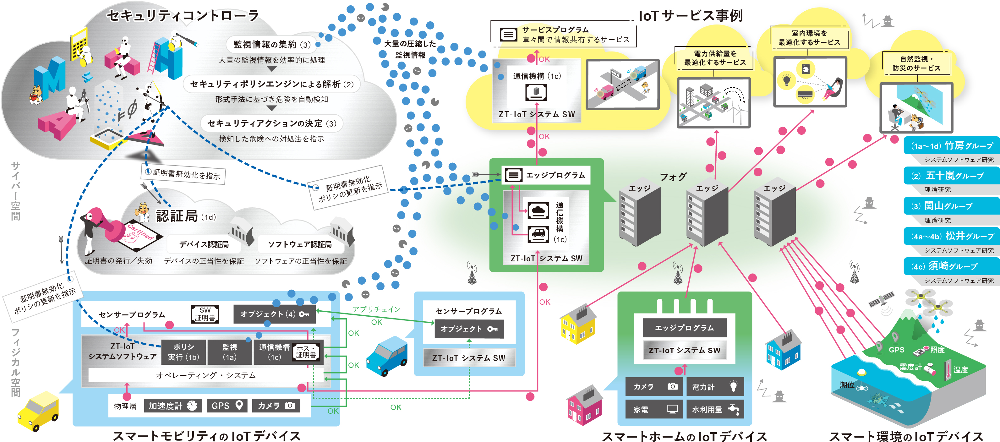

[\[English\]](https://zt-iot.nii.ac.jp/en/)

<table>
  <tr>
    <td> <a href="#topics">Topics</a></td>
    <td> <a href="#overview">研究概要</a></td>
    <td> <a href="#member">メンバー</a></td>
    <td> <a href="#publications">研究業績</a></td>
  </tr>
</table>

# 形式検証とシステムソフトウェアの協働によるゼロトラストIoT
JST CREST研究領域：[基礎理論とシステム基盤技術の融合によるSociety 5.0のための基盤ソフトウェアの創出 (S5基盤ソフト)](https://www.jst.go.jp/kisoken/crest/research_area/ongoing/bunya2021-2.html)

<!--

## 公募情報
-->

## Topics
* 2025/11 [SC25](https://sc25.supercomputing.org/)の展示会場で本ブロジェクトの展示発表を行う予定です． [Link](https://ccrd.nii.ac.jp/sc25/)
* 2025/10 [CEATEC 2025](https://www.ceatec.com/ja/)で展示発表を行います．[Link](https://www.ceatec.com/nj/exhibitor_detail_ja?id=1852)
* 2024/11 [SC24](https://sc24.supercomputing.org/)の展示会場で本ブロジェクトの展示発表を行いました． [Link](https://ccrd.nii.ac.jp/sc24/)
* 2023/11 [SC23](https://sc23.supercomputing.org/)の展示会場で本ブロジェクトの展示発表を行いました． [Link](https://ccrd.nii.ac.jp/sc23/) 
* 2022/11/01 11/14-17に[SC22](https://sc22.supercomputing.org/)の展示会場(Booth# 4205)で本ブロジェクトの展示発表を行います． [PDF](https://drive.google.com/file/d/1SXcRYDSkcyxqTAewuJm5YerkvJG_13ss/view?usp=sharing) 
* 2021/09/21 [2021年度 戦略的創造研究推進事業 (CREST)，研究領域「基礎理論とシステム基盤技術の融合によるSociety 5.0のための基盤ソフトウェアの創出 (S5基盤ソフト)」に採択されました．](https://www.jst.go.jp/kisoken/crest/application/2021/210921/210921crest.pdf)

## 研究概要
形式検証とシステムソフトウェアの融合により、ゼロトラスト(ZT)の概念を踏襲した安全なIoTシステムを実現します。理論研究では、IoTのトラストチェーンの正当性に数学的証明を与え、動的検証の併用で未知の脅威にも対応します。システムソフト研究では理論的成果と連係して実行隔離・自動検知・自動対処機構を開発し，ZT-IoTを実証します。アカウンタビリティを保証することでIoTの社会受容を促進します。

<!--img src="images/overview-JP_rgb202406_4x.jpg" width="100%" title="ZT-IoTプロジェクトの研究概要"-->

## メンバー
### NIIシステムソフトウェアグループ
- [竹房 あつ子](https://researchmap.jp/takefusa) (研究代表者), [国立情報学研究所](https://www.nii.ac.jp/) アーキテクチャ科学研究系 教授
- [石川 裕](https://researchmap.jp/yutaka_ishikawa), 大妻女子大学 データサイエンス学部 教授
- [合田 憲人](https://researchmap.jp/aida), 国立情報学研究所 アーキテクチャ科学研究系 教授
- [清水 さや子](https://researchmap.jp/smzs), 国立情報学研究所 アーキテクチャ科学研究系 助教
- [北川 直哉](https://researchmap.jp/7000026496), 国立情報学研究所 学術ネットワーク研究開発センター 特任准教授
- [小林 久美子](https://researchmap.jp/kobayashikumiko), 国立情報学研究所 クラウド基盤研究開発センター 特任研究員
- [坂根 栄作](https://researchmap.jp/sakaneeisaku), 国立情報学研究所 アーキテクチャ科学研究系 准教授
- [西村 健](https://researchmap.jp/nishimuratakeshi), 国立情報学研究所 学術基盤推進部 特任研究員
- [丹生 智也](https://researchmap.jp/ttanjo), 国立情報学研究所 クラウド基盤研究開発センター 特任研究員
- YIN, Jie, 国立情報学研究所 アーキテクチャ科学研究系 特任研究員
- 山下 直希, 国立情報学研究所 アーキテクチャ科学研究系 特任研究員
- 青木 信雄, [総合研究大学院大学](https://www.soken.ac.jp/) 先端学術院 先端学術専攻 情報学コース 大学院生（博士課程）(RA)

### 京大理論グループ
- [五十嵐 淳](https://researchmap.jp/Atsushi.Igarashi) (主たる共同研究者), [京都大学](https://www.i.kyoto-u.ac.jp) 大学院情報学研究科 教授
- [末永 幸平](https://researchmap.jp/ksuenaga), 京都大学 大学院情報学研究科 准教授
- [和賀 正樹](https://researchmap.jp/mwaga), 京都大学 大学院情報学研究科 助教
- [PARK, Sewon](https://researchmap.jp/sewonpark), 京都大学 大学院情報学研究科 特定研究員 (〜2025年9月) / リュブリャナ大学 研究員 
- 神 拓己，京都大学 大学院情報学研究科 情報学専攻 大学院生 (修士課程)
- [西田 雄気](https://researchmap.jp/yuki-nishida)，京都大学 大学院情報学研究科 特定研究員 (〜2023年4月)
- 稲葉 皓信, 京都大学 大学院情報学研究科 通信情報システム専攻 大学院生 (修士課程) (〜2023年10月)
- SHI, Zhen, 京都大学 大学院情報学研究科 通信情報システム専攻 大学院生 (修士課程) (〜2023年3月)
- 阪口 裕飛, 京都大学 大学院情報学研究科 通信情報システム専攻 大学院生 (修士課程) (〜2023年3月)

### NII理論グループ
- [関山 太朗](https://researchmap.jp/t-sekiym) (主たる共同研究者), [国立情報学研究所](https://www.nii.ac.jp/) アーキテクチャ科学研究系 准教授
- [石川 冬樹](https://researchmap.jp/f-ishikawa), 国立情報学研究所 アーキテクチャ科学研究系 准教授
- [勝股 審也](https://researchmap.jp/shinya_katsumata), 国立情報学研究所 アーキテクチャ科学研究系 特任准教授
- [蓮尾 一郎](https://researchmap.jp/read0136635), 国立情報学研究所 アーキテクチャ科学研究系 教授
- [福田 健介](https://researchmap.jp/kensuke/), 国立情報学研究所 アーキテクチャ科学研究系 教授
- BRUN, Lelio, 国立情報学研究所 アーキテクチャ科学研究系 特任研究員
- 中林 美郷, [総合研究大学院大学](https://www.soken.ac.jp/) 複合科学研究科情報学専攻 大学院生（博士課程）
- 椎葉 瑠星, 総合研究大学院大学 複合科学研究科情報学専攻 大学院生（博士課程）
- 藤浪 大弥, 総合研究大学院大学 複合科学研究科情報学専攻 大学院生（博士課程）
- 田口 研治, 国立情報学研究所 アーキテクチャ科学研究系 特任研究員 (〜2022年3月)

### TIDシステムソフトウェアグループ
- [松井 俊浩](https://www.tid.ac.jp/contents/professor/toshihiro-matsui/) (主たる共同研究者), [東京情報デザイン専門職大学](https://www.tid.ac.jp) 情報デザイン学科 教授
- 小野 泰司, 東京情報デザイン専門職大学 情報デザイン学科 特任助手
- 若月 里香, 東京情報デザイン専門職大学 情報デザイン学科 特任助手

### IISECシステムソフトウェアグループ
- [須崎　有康](https://www.iisec.ac.jp/education/professors/suzaki.html) (主たる共同研究者), [情報セキュリティ大学院大学](https://www.iisec.ac.jp) 情報セキュリティ研究科 教授
- 小野 泰司, 情報セキュリティ大学院大学 情報セキュリティ研究科 特任助手
- 若月 里香, 情報セキュリティ大学院大学 情報セキュリティ研究科 特任助手

## 研究業績

### 雑誌論文, 査読付き会議

#### 2025年度
- Reina Sasaki, Atsuko Takefusa, Hidemoto Nakada, Masato Oguchi, Communication Performance of ROS and ROS 2-based IoT Systems for Smart Home Applications, IEICE Transactions on Information and Systems, vol.E108-D, no.8, pp. 895-905, Aug. 2025. [doi: 10.1587/transinf.2024dap0005](https://doi.org/10.1587/transinf.2024dap0005)
- Jie Yin, Yutaka Ishikawa, Atsuko Takefusa, A Lightweight Monitoring and Anomaly Detection Framework for IoT Devices, Proc. IEEE COMPSAC 2025, pp. 1184-1193, Jul. 2025. [doi: 10.1109/COMPSAC65507.2025.00151](https://doi.org/10.1109/COMPSAC65507.2025.00151)
- Sewon Park, Atsushi Igarashi, Making Rabbit Run for Security Verification of Networked Systems with Unbounded Loops, Proc. FMCAD 2025, OCt. 2025. 
[doi: 10.34727/2025/isbn.978-3-85448-084-6_24](https://doi.org/10.34727/2025/isbn.978-3-85448-084-6_24)

#### 2024年度
- Taro Sekiyama, Hiroshi Unno, Algebraic Temporal Effects: Temporal Verification of Recursively Typed Higher-Order Programs, Proc. ACM Program. Lang. 9(POPL), pp. 2306-2336, Jan. 2025. [doi: 10.1145/3704914](https://dl.acm.org/doi/10.1145/3704914)
- Chisa Ito, Atsuko Takefusa, Hidemoto Nakada, Masato Oguchi, A Study of Effective Compression Methods for IoT Communication, Proc. 2025 IEEE International Conference on Consumer Electronics (ICCE), pp. 1-6, Jan. 2025. [doi: 10.1109/ICCE63647.2025.10929811](https://doi.org/10.1109/ICCE63647.2025.10929811)
- 小林 久美子, 竹房 あつ子, 北川 直哉, 大島 浩太, 竹島 雅之, 平田 真樹, 森松 文毅, 吉田 浩, 合田 憲人, IoT アプリケーションシステムのための SINETStream 多種センサデータ可視化・監視機能の開発, 学術情報処理研究 (JACN), vol. 28, no. 1, pp. 66-75, Nov. 2024. [doi: 10.24669/jacn.28.1_66](https://doi.org/10.24669/jacn.28.1_66)
- Terunobu Inaba, Yutaka Ishikawa, Atsushi Igarashi, Taro Sekiyama, Rabbit: A Language to Model and Verify Data Flow in Networked Systems, Proc. the 11th International Symposium on Networks, Computers and Communications (ISNCC'24). [doi: 10.1109/ISNCC62547.2024.10758938](https://doi.org/10.1109/ISNCC62547.2024.10758938)
- Masaki Waga, Kotaro Matsuoka, Takashi Suwa, Naoki Matsumoto, Ryotaro Banno, Song Bian, Kohei Suenaga, Oblivious Monitoring for Discrete-Time STL via Fully Homomorphic Encryption, Proc. The 24th International Conference on Runtime Verification (RV 2024). [doi: 10.1007/978-3-031-74234-7_4](https://doi.org/10.1007/978-3-031-74234-7_4)
- Taro Sekiyama, Hiroshi Unno, Higher-Order Model Checking of Effect-Handling Programs with Answer-Type Modification, Proc. the ACM on Programming Languages, vol. 8, no. OOPSLA2, 30 pages, 2024. [doi: 10.1145/3689805](https://doi.org/10.1145/3689805)
- Atsuya Osaki, Manuel Poisson, Seiki Makino, Ryusei Shiiba, Kensuke Fukuda, Tadashi Okoshi, Jin Nakazawa, Dynamic Fixed-point Values in eBPF: a Case for Fully In-kernel Anomaly Detection, Proc. AINTEC 2024, pp. 46-54, Aug. 2024. [doi: 10.1145/3674213.3674219](https://doi.org/10.1145/3674213.3674219)
- Manuel Poisson, Rodrigo Carnier, Kensuke Fukuda, GothX: a generator of customizable, legitimate and malicious IoT network traffic, Proc. CSET 2024, pp. 65-73, Aug. 2024. [doi: 10.1145/3675741.3675753](https://doi.org/10.1145/3675741.3675753)
- Jie Yin, Yutaka Ishikawa, Atsuko Takefusa, A Linux Audit and MQTT based Monitoring Framework for IoT Devices and Its Evaluation, IPSJ Journal special issue of “Applications and the internet” in conjunction with the main topics of COMPSAC 2023, vol. 65, no. 8, pp. 586-595, Aug. 2024. [doi: 10.2197/ipsjjip.32.586](https://doi.org/10.2197/ipsjjip.32.586)
- Yuye Uezato, Regular Expressions with Backreferences and Lookaheads Capture NLOG, Proc. the 51st International Colloquium on Automata, Languages, and Programming (ICALP), vol. 297, no. 155, pp. 1-20, Jul. 2024. [doi: 10.4230/LIPICS.ICALP.2024.155](https://doi.org/10.4230/LIPICS.ICALP.2024.155)
- Takashi Yagawa, Tadanori Teruya, Kuniyasu Suzaki, Hirotake Abe, Delegating Verification for Remote Attestation using TEE, Proc. IEEE European Symposium on Security and Privacy Workshops (EuroS&PW), pp. 186-192, Jul. 2024. [doi: 10.1109/EuroSPW61312.2024.00025](https://doi.org/10.1109/EuroSPW61312.2024.00025)
- Chisa Ito, Atsuko Takefusa, Hidemoto Nakada, Masato Oguchi, Communication Performance Evaluation Using Compression Processing for IoT Systems in Mobile Environments, Proc. IEEE COMPSAC 2024, SIS-SS, pp. 2374-2379, Jul. 2024. [doi: 10.1109/COMPSAC61105.2024.00380](https://doi.org/10.1109/COMPSAC61105.2024.00380)
- Misato Nakabayashi, Taro Sekiyama, Ichiro Hasuo, Yutaka Ishikawa, Formal Support for Threat Modeling with Attack Decision Diagrams, Proc. the 18th IEEE International Workshop on Security, Trust, and Privacy for Software Applications, pp. 2454-2459, Jul. 2024. [doi: 10.1109/COMPSAC61105.2024.00394](https://doi.org/10.1109/COMPSAC61105.2024.00394)
- Nobuo Aoki, Atsuko Takefusa, Yutaka Ishikawa, Yasushi Ono, Eisaku Sakane, Kento Aida, ZT-OTA Update Framework for IoT Devices toward Zero Trust IoT, Proc. IEEE Computers, Software, and Applications Conference (COMPSAC 2024), NETSAP, pp. 2200-2207, Jul. 2024. [doi: 10.1109/COMPSAC61105.2024.00352](https://doi.org/10.1109/COMPSAC61105.2024.00352)
- 須崎 有康, IoTデバイスにおけるTEE (Trusted Execution Environment) の実装, システム制御情報学会 システム/制御/情報 「IoTとセキュリティ」特集号, vol. 68, no. 5, pp. 185-190, May 2024.
- 竹房 あつ子, ゼロトラストIoTのためのシステムソフトウェア研究, システム制御情報学会 システム/制御/情報 「IoTとセキュリティ」特集号, vol. 68, no. 5, pp. 191-196, May 2024.
- Hiroya Fujinami, Ichiro Hasuo, Efficient Matching with Memoization for Regexes with Grouping, Proc. the 33rd European Symposium on Programming, pp. 90-118, Apr. 2024. [doi: 10.1007/978-3-031-57267-8_4](https://doi.org/10.1007/978-3-031-57267-8_4)

#### 2023年度
- Taichi Takemura, Ryo Yamamoto, Kuniyasu Suzaki, TEE-PA: TEE Is a Cornerstone for Remote Provenance Auditing on Edge Devices With Semi-TCB, IEEE ACCESS, vol. 12, pp. 26536-26549, Feb. 2024. [doi: 10.1109/ACCESS.2024.3366344](https://doi.org/10.1109/ACCESS.2024.3366344)
- Uyen Do, Laura Lahesoo, Rodrigo Matos Carnier, Kensuke Fukuda, Evaluation of XAI Algorithms in IoT Traffic Anomaly Detection, Proc. the 6th International Conference on Artificial Intelligence in Information and Communication, pp. 669-674, Feb. 2024. [doi: 10.1109/ICAIIC60209.2024.10463357](https://doi.org/10.1109/ICAIIC60209.2024.10463357)
- Fuga Kawamata, Hiroshi Unno, Taro Sekiyama, Tachio Terauchi, Answer Refinement Modification: Refinement Type System for Algebraic Effects and Handlers, Proc. the ACM on
Programming Languages, pp. 115-147, Jan. 2024. [doi 10.1145/3633280](https://doi.org/10.1145/3633280)
- Laura Lahesoo, Uyen Do, Rodrigo Carnier, Kensuke Fukuda, SIURU: A Framework for Machine Learning Based Anomaly Detection in IoT Network Traffic, Proc. the 18th Asian Internet Engineering Conference, pp. 87-95, Dec. 2023. [doi: 10.1145/3630590.3630601](https://doi.org/10.1145/3630590.3630601)
- Lélio Brun, Ichiro Hasuo, Yasushi Ono and Taro Sekiyama, Automated Security Analysis for Real-World IoT Devices. Proc. HASP '23: Hardware and Architectural Support for Security and Privacy, pp 29-37, Oct. 2023. [doi: 10.1145/3623652.3623667)](https://doi.org/10.1145/3623652.3623667)
- Jie Yin, Yutaka Ishikawa, Atsuko Takefusa, A Linux Audit and MQTT-based Security Monitoring Framework, Proc. IEEE COMPSAC 2023, pp. 648-657, Jun. 2023.
- Taro Sekiyama, Unno Hiroshi, Temporal Verification with Answer-Effect Modification: Dependent Temporal Type- and-Effect System with Delimited Continuations, Proceedings of the ACM on Programming Languages (POPL), 7, POPL, pp. 2079-2110, Apr. 2023. [doi: 10.1145/3571264](https://doi.org/10.1145/3571264)
- 竹房 あつ子, 小林 久美子, 北川 直哉, 孫 静涛, 吉田 浩, 合田 憲人, IoTアプリ構築支援のためのSINETStream Androidライブラリおよびセンサ情報収集アプリの開発, 情報処理学会論文誌デジタルプラクティス(TDP), 4, pp. 110-121, 2023年4月. [Link](https://www.ipsj.or.jp/dp/contents/publication/54/TR0402-12.html)

#### 2022年度
- Naoya Kitagawa, Atsuko Takefusa, Kento Aida, Development of a Secure Data Sharing Mechanism for IoT Application Systems, Proc. 2022 IEEE 11th International Conference on Cloud Networking (CloudNet), pp. 131-135, Nov. 2022. [doi: 10.1109/CloudNet55617.2022.9978835](https://doi.org/10.1109/CloudNet55617.2022.9978835)
- Ryotaro Banno, Kotaro Matsuoka, Naoki Matsumoto, Song Bian, Masaki Waga, Kohei Suenaga, Oblivious Online Monitoring for Safety LTL Specification via Fully Homomorphic Encryption, Lecture Notes in Computer Science (Computer Aided Verification), 13371, pp. 447-468, Aug. 2022. [Link](https://link.springer.com/chapter/10.1007/978-3-031-13185-1_22)

### 講演，口頭発表等

#### 2024年度
- [Poster] 神 拓⼰, 五⼗嵐 淳, eBPFプログラムの機能正当性検証に向けた検証フレームワークの提案 [PPL 2025 スポンサー特別賞], 第27回プログラミングおよびプログラミング言語ワークショップ PPL 2025, Mar. 2025.
- [Poster] Atsushi Igarashi, Yutaka Ishikawa, Sewon Park, Taro Sekiyama, Extending Rabbit towards verified networked systems with user-defined semantics for system calls, 第27回プログラミングおよびプログラミング言語ワークショップ PPL 2025, Mar. 2025.
- [Talk] Eisaku Sakane, Atsuko Takefusa, A Design of Automatic Certificate Management for a Zero Trust IoT System, International Symposium on Grids and Clouds (ISGC) 2025. 
- [Talk] 伊藤 千紗, 竹房 あつ子, 中田 秀基, 小口 正人, JPEG圧縮を適用したIoT通信性能と物体検出精度の評価 [学生奨励賞], 情報処理学会 第87回全国大会, 2ZC-03, Mar. 2025.
- [Talk] 伊藤 千紗, 竹房 あつ子, 中田 秀基, 小口 正人, IoT通信のためのJPEG圧縮と物体検出精度の性能評価, DEIM2025 第17回データ工学と情報マネジメントに関するフォーラム 3D-04, Feb. 2025.
- [Talk] Kuniyasu Suzaki, Remote Attestation on Arm TrustZone OP-TEE with VERAISON Verifier - current status and future plan -, FOSDEM: Free and Open Source Development European Meeting, Feb. 2025.
- [Talk] 伊藤 千紗, 竹房 あつ子, 中田 秀基, 小口 正人, IoT環境におけるデータ圧縮処理を適用した通信手法の評価［奨励講演］, 電子情報通信学会 NS2024-183, vol. 124, no. 344, pp. 77-82, Jan. 2025. 
- [Invited Talk] 竹房 あつ子, システムソフトウェアと形式検証によるゼロトラストIoT, IEICE HWS主催 ハードウェアセキュリティフォーラム 2024, Dec. 2024.
- [Talk] 伊藤 千紗, 竹房 あつ子, 中田 秀基, 小口 正人, IoT通信のための効果的なデータ圧縮処理の調査, 電子情報通信学会 NS2024-105, vol. 124, no. 197, pp. 80-85, Oct. 2024
- [Keynote] 竹房 あつ子, システムソフトウェアと形式検証によるゼロトラストIoTの実現, SASE・ハイブリッドワーク時代のセキュリティ 2024 秋, 基調講演, Oct. 2024.
- [Poster] 青木 信雄, 山下 直希, 丹生 智也, 坂根 栄作, 合田 憲人, 石川 裕, 小野 泰司, 竹房 あつ子, IoTソフトウェアの信頼性とレジリエンスを高めるZT-OTA Update Frameworkのプロトタイプ実装, Computer Security Symposium 2024, Demonstration, Oct. 2024.
- [Poster] Jie Yin, Yutaka Ishikawa, Atsuko Takefusa, Towards A light-weight Anomaly Detection Framework for IoT Devices, Computer Security Symposium 2024, Poster, Oct. 2024.
- [Talk] 佐々木 怜名, 石川 裕, 竹房 あつ子, 中田 秀基, 小口 正人, IoTシステムにおける属性ベース暗号の活用に向けた検討, Computer Security Symposium 2024, Oct. 2024.
- [Poster] 佐々木 怜名, 石川 裕, 竹房 あつ子, 中田 秀基, 小口 正人, 属性ベース暗号を用いたIoT通信の性能評価, xSIG 2024 (ポスター), Aug. 2024.
- [Poster] Atsuko Takefusa, Yutaka Ishikawa, Yasushi Ono, Design of Trust Chained IoT Key Management using OP-TEE, USENIX OSDI '24, Poster, Jul. 2024.
- [Poster] Lelio Brun, Taro Sekiyama, 実世界のIoTデバイスの自動セキュリティ分析, NIIオープンハウス2024 ポスター展示, Jun. 2024.
- [Poster] 稲葉 皓信, 関山 太朗, 五 十嵐 淳, 石川 裕, IoTシステムのモデル化とセキュリティ検証のためのプログラミング言語 Rabbit, NIIオープンハウス2024 ポスター展示, Jun. 2024.
- [Poster] 竹房 あつ子, 関山 太郎, 福田 健介, 蓮尾 一郎, 合田 憲人, 石川 裕, Society 5.0のためのゼロトラストIoT, NIIオープンハウス2024 ポスター展示, Jun. 2024.
- [Poster] 青木 信雄, 竹房 あつ子, 石川 裕, 小野 泰司, 坂根 栄作, 合田 憲人, IoTシステムのソフトウェアの信頼性とレジリエンスを強化するソフトウェア更新, NIIオープンハウス2024 ポスター展示, Jun. 2024.

#### 2023年度
- [Talk] 稲葉 皓信, 五十嵐 淳, 石川 裕, 関山 太朗, データフローセキュリティの検証のためのIoTシステムモデリング言語 Rabbit, 第26回プログラミングおよびプログラミング言語ワークショップ, Mar. 2024.
- [Invited Talk] Atsuko Takefusa, System Software Studies towards Zero Trust IoT (ZT-IoT), Cloud-edge Fusion (CEF) Symposium, CENTRA 7, Feb. 2024.
- [Talk] 中林 美郷，関山 太朗，蓮尾 一郎，石川 裕, 攻撃決定図の自動生成によるTamarin Proverの脅威モデリング支援, 2024年暗号と情報セキュリティシンポジウム(SCIS2024), Jan. 2024.
- [Talk] 合田 憲人, 山下 直希, 丹 生 智也, 坂根 栄作, 小野 泰司, 青木 信雄, 竹房 あつ子, 石川 裕, 研究ソフトウェア信頼性保証のためのソフトウェア認証機構, 2024年暗号と情報セキュリティシンポジウム(SCIS2024), Jan. 2024.
- [Invited Talk] 竹房 あつ子, SINETStreamによるIoTデータ利活用支援, データ活用社会創成シンポジウム2023, Dec. 2023.
- 竹房 あつ子, 小野 泰司, 石川 裕, OP-TEEを用いたZero Trust IoTのための階層鍵管理機構の性能評価実験, インターネットと運用技術
シンポジウム(IOTS2023) (ポスター), Dec. 2023.
- [Exhibition] Zero Trust based IoT Security, SC23 Exhibition Booth #256, Nov. 2023． [Link](https://ccrd.nii.ac.jp/sc23/)
- [Invited Talk] 関山 太朗, 形式検証によるセキュアなIoTシステムの実現に向けて, コンピュータセキュリティシンポジウムCSS2023 形式検証とセキュリティワークショップ, Nov. 2023.
- [Talk] 青木 信雄, 竹房 あつ子, 石川 裕, 小野 泰司, 坂根 栄作, 合田 憲人, ゼロトラストIoTに向けたIoT機器のOTAソフトウェアアップデートフレームワークの検討, コンピュータセキュリティシンポジウムCSS2023論文集 2F3-4, pp. 652-659, Oct. 2023.
- [Invited Talk] Taro Sekiyama, Answer-Refinement Modification: A refinement type system for algebraic effect handlers, Shonan Meeting No.203 (Effect Handlers and General-Purpose Languages), Aug. 2023.
- [Talk] 大崎 敦也, 牧野 青希, 椎葉 瑠星, 福田 健介, 大越 匡, 中澤 仁, eBPFとXDPを用いた高速なDDoS攻撃検出・自動対処システムの提案と実装, 電子情報通信学会 IA研究会, Sep. 2023.
- [Talk] 今井 航一，石川 裕，加藤 真平, IoTにおけるTrusted Execution Environmentによるシステムコールのモニタリングとポリシー管理の設計, 情報処理学会研究報告 2023-OS-160, Aug. 2023.
- [Talk] 稲葉 皓信, 関山 太朗, 五十嵐 淳, 石川 裕, Rabbit: a modeling language for verifying data-flow 
security, 情報処理学会研究報告 PRO, Aug. 2023.
- [Talk] 竹房 あつ子, 小野 泰司, 石川 裕, OP-TEEを用いたIoTにおける安全な階層鍵管理機構の検討, 情報処理学会研究報告 2023-OS-160, No. 11, pp. 1-12, Aug. 2023.
- [Poster] 青木 信雄, 竹房 あつ子, 石川 裕, 小野 泰司, 坂根 栄作, 合田 憲人, ゼロトラストIoTに基づくIoT機器のOTAソフトウェア更新実現にむけて, cross-disciplinary workshop on computing Systems, Infrastructures, and programminG 2023 (xSIG2023), Aug. 2023.
- [Poster] Society 5.0のためのゼロトラストIoT. NIIオープンハウスポスター, 2023年6月.

#### 2022年度
- [Poster] Sayako Shimizu, Eisaku Sakane, Takeshi Nishimura, Kento Aida, Atsuko Takefusa, Certification Mechanism to Assure Software Reliability with Digital Signature, International Symposium on Grids & Clouds (ISGC), Mar. 2023.
- [Invited Talk] 竹房 あつ子, 形式検証とシステムソフトウェアの協働によるゼロトラストIoT, 情報処理学会第85回全国大会 イベント企画「Society 5.0時代の 安心・安全・信頼を支える基盤ソフトウェア技術の構築」, 2023年3月.
- [Talk] 川島 佑介，松井 俊浩, パスワード及びログの保存設定に着目したIoTデバイスにおけるファームウェアの安全性調査, 情報処理学会第100回コンピュータセキュリティ研究会CSEC, 2023年3月.
- [Invited Talk] Atsuko Takefusa, Building System Software for Zero Trust IoT (ZT-IoT), Secure Device Forum 2023, Feb. 2023.
- [Invited Talk] Atsushi Igarashi, (I Can't Get No) Verification, ACM SIGPLAN International Conference on Systems, Programming, Languages, and Applications (SPLASH), Dec. 2022. [Link](https://dl.acm.org/doi/abs/10.1145/3563768.3570524)
- [Exhibition] Zero Trust based IoT Security, SC22 Exhibition Booth #4205, 2022年11月．[PDF](https://drive.google.com/file/d/1SXcRYDSkcyxqTAewuJm5YerkvJG_13ss/view?usp=sharing)
- [Talk] 松本 悟、松井 俊浩, Pub/Sub 通信を行うコネクテッド自動運転車の周囲で捕捉されるデジタル証拠収集機能の提案, コンピュータセキュリティシンポジウムCSS2022, 2022年10月.
- [Invited Talk] 竹房 あつ子, ゼロトラストIoT (ZT-IoT)に向けたシステムソフトウェアの研究, 電子情報通信学会ソサイエティ大会, BI-4-1, 2022年9月. [Link](https://www.ieice-taikai.jp/2022society/jpn/webpro/_html/cs_kikaku.html#bi_4)
- [Invited Talk] 松井 俊浩, 小野 泰司, 信頼の基点に基づくIoTデバイスの通信, 電子情報通信学会ソサイエティ大会, BI-4-2, 2022年9月. [Link](https://www.ieice-taikai.jp/2022society/jpn/webpro/_html/cs_kikaku.html#bi_4)
- [Talk] 石川 裕, Yin Jie, 竹房 あつ子, 松井 俊浩, 小野 泰司, 合田 憲人, Pub/Sub通信モデルを用いたセキュリティ監視機構の検討, 情報処理学会研究報告, vol. 2022-OS-156, no. 2, pp. 1-6, 2022年7月. [Link](http://id.nii.ac.jp/1001/00218868/), [Slide](https://drive.google.com/file/d/1Vxm7Yk7b2LSvtr8cyOFtV6g4i7n857Jw/view?usp=sharing)
- [Poster] Society 5.0のためのゼロトラストIoT. NIIオープンハウスポスター, 2022年6月. [PDF](https://drive.google.com/file/d/1NubCDcZBdBOFwC2MvgTIdbCKVqZWvaMF/view?usp=sharing)

#### 2021年度
- [Talk] 竹房 あつ子, 五十嵐 淳, 関山 太郎, 松井 俊浩, 小野 泰司, 福田 健介, 蓮尾 一郎, 合田 憲人, 石川 裕, ZT-IoT: ゼロトラストIoTのためのシステムソフトウェア構築に向けて, 情報処理学会研究報告, vol. 2022-OS-154, no. 3, pp. 1-16, 2022年3月. [Link](http://id.nii.ac.jp/1001/00217217/), [Slide](https://drive.google.com/file/d/1cxKrYkvDgTMrmB6wWGnWV0DMFo_JH-xN/view?usp=sharing)
- [Poster] 竹房 あつ子, 五十嵐 淳, 関山 太郎, 松井 俊浩, 小野 泰司, 福田 健介, 蓮尾 一郎, 合田 憲人, 石川 裕, ZT-IoT: ゼロトラストIoTのためのシステムソフトウェアの検討, 情報処理学会 第154回OS研究発表会, 2022年3月.
- [Invited Talk] 竹房あつ子, 形式検証とシステムソフトウェアの協働によるゼロトラストIoT, CREST/さきがけセッション, ComSys 2021, 2021年12月.

### 公開ソフトウェア・データ
- [software] Rabbit, [https://github.com/zt-iot/rabbit](https://github.com/zt-iot/rabbit), 2025.
- [software] GothX traffic generator, [https://github.com/fukuda-lab/GothX](https://github.com/fukuda-lab/GothX), 2025.
- [database, software] OP-TEE Remote Attestation with VERAISON Verification, [https://github.com/iisec-suzaki/optee-ra](https://github.com/iisec-suzaki/optee-ra), 2024.
