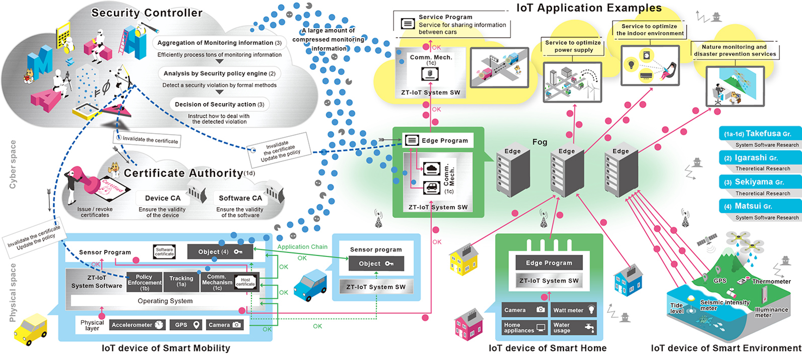

[\[Japanese\]](https://zt-iot.nii.ac.jp/)

# Zero Trust IoT by Formal Verification and System Software
CREST Research Area: [\[Society 5.0 System Software\] Creation of System Software for Society 5.0 by Integrating Fundamental Theories and System Platform Technologies](https://www.jst.go.jp/kisoken/crest/en/research_area/ongoing/area2021-2.html)

## Topics
- 2022/11/01 The ZT-IoT project is presented at the [SC22](https://sc22.supercomputing.org/) Exhition Booth #4205 in Dallas. [PDF](https://drive.google.com/file/d/1SXcRYDSkcyxqTAewuJm5YerkvJG_13ss/view?usp=sharing)

## Research Outline
This project aims to realize secure Internet of Things (IoT) systems in accordance with the concept of zero trust by the fusion of formal verification and system software technologies.
In the formal verification research, we provide mathematical proofs for the legitimacy of IoT trust chains and address unknown threats combining static and dynamic verification. 
In the system software research, we develop mechanisms for isolated execution, automatic detection, and automatic countermeasure in conjunction with the theoretical results in order to demonstrate zero trust IoT. 
We also promote social acceptance of IoT by ensuring the accountability.

## Members

Takefusa Gr.

<table>
  <tr>
    <td>
      <b>Research Director</b> 
      <a href="https://researchmap.jp/takefusa?lang=en">Atsuko Takefusa</a> 
	Professor, 
      Information Systems Architecture Sciences Research Division,  
      <a href="https://www.nii.ac.jp/en/">National Institute of Informatics</a>
    </td>
  </tr>
 
 <tr>
    <td>
	<a href="https://researchmap.jp/yutaka_ishikawa?lang=en">Yutaka Ishikawa</a> 
	Professor, 
      Information Systems Architecture Sciences Research Division,  
	National Institute of Informatics
    </td>
  </tr>
 
 <tr>
    <td>
	<a href="https://researchmap.jp/aida?lang=en">Kento Aida</a> 
	Professor, 
      Information Systems Architecture Sciences Research Division,   
	National Institute of Informatics
    </td>
  </tr>

 <tr>
    <td>
	<a href="https://researchmap.jp/smzs?lang=en">Sayako Shimizu</a>  
	Assistant Professor, 
      Information Systems Architecture Sciences Research Division,   
	National Institute of Informatics
    </td>
  </tr>

 <tr>
    <td>
	<a href="https://researchmap.jp/7000026496?lang=en">Naoya Kitagawa</a> 
	Project Associate Professor, 
      Research and Development Center for Academic Networks,  
	National Institute of Informatics
    </td>
  </tr>

 <tr>
    <td>
	<a href="https://researchmap.jp/kobayashikumiko?lang=en">Kumiko Kobayashi</a> 
	Project Researcher, 
	Center for Cloud Research and Development,  
	National Institute of Informatics
    </td>
  </tr>

 <tr>
    <td>
	<a href="https://researchmap.jp/sakaneeisaku?lang=en">Eisaku Sakane</a> 
	Associate Professor, 
	Information Systems Architecture Sciences Research Division,  
	National Institute of Informatics
    </td>
  </tr>
 <tr>
    <td>
	<a href="https://researchmap.jp/nishimuratakeshi?lang=en">Takeshi Nishimura</a> 
	Project Researcher, 
	Cyber Science Infrastructure Development Department,  
	National Institute of Informatics
    </td>
  </tr>

 <tr>
    <td>
	Jie YIN  
	Project Researcher, 
      Information Systems Architecture Sciences Research Division,   
	National Institute of Informatics
    </td>
  </tr>
	
 <tr>
    <td>
	Nobuo Aoki  
	Doctoral Student, 
	Department of Informatics, 
	School of Multidisciplinary Sciences,  
	<a href="https://www.nii.ac.jp/graduate/en/">The Graduate University For Advanced Studies (SOKENDAI)</a>
    </td>
  </tr>

</table>

Igarashi Gr.

<table>
  <tr>
    <td>
	<b>Collaborator</b> 
	<a href="https://researchmap.jp/Atsushi.Igarashi?lang=en">Atsushi Igarashi</a> 
	Professor, 
	Department of Communications and Computer Engineering,  
	Graduate School of Informatics, 
	<a href="https://www.i.kyoto-u.ac.jp">Kyoto University</a>
    </td>
  </tr>

  <tr>
    <td>
	<a href="https://researchmap.jp/ksuenaga?lang=en">Kohei Suenaga</a> 
	Assoc. Professor, 
	Department of Communications and Computer Engineering,  
	Graduate School of Informatics, 
	Kyoto University
    </td>
  </tr>

  <tr>
    <td>
	<a href="https://researchmap.jp/mwaga?lang=en">Masaki Waga</a> 
	Assistant Professor, 
	Department of Communications and Computer Engineering,  
	Graduate School of Informatics, 
	Kyoto University
    </td>
  </tr>

  <tr>
    <td>
    Terunobu Inaba 
    Master's Student,
	Department of Communications and Computer Engineering,  
	Graduate School of Informatics,
	Kyoto University
    </td>
  </tr>

  <tr>
    <td>
    Shi Zhen 
    Master's Student,
	Department of Communications and Computer Engineering,  
	Graduate School of Informatics,
	Kyoto University
    </td>
  </tr>

  <tr>
    <td>
    Yuhi Sakaguchi 
    Master's Student,
	Department of Communications and Computer Engineering,  
	Graduate School of Informatics,
	Kyoto University
    </td>
  </tr>

</table>

Sekiyama Gr.

<table>
  <tr>
    <td>
	<b>Collaborator</b> 
	<a href="https://researchmap.jp/t-sekiym?lang=en">Taro Sekiyama</a> 
	Assistant Professor, 
	Information Systems Architecture Sciences Research Division,  
	<a href="https://www.nii.ac.jp/en/">National Institute of Informatics</a>
    </td>
  </tr>

  <tr>
    <td>
      <a href="https://researchmap.jp/f-ishikawa?lang=en">Fuyuki Ishikawa</a> 
	Associate Professor, 
	Information Systems Architecture Sciences Research Division,  
      National Institute of Informatics
    </td>
  </tr>

  <tr>
    <td>
      <a href="https://researchmap.jp/shinya_katsumata?lang=en">Shin-ya Katsumata</a> 
	Project Associate Professor, 
	Information Systems Architecture Sciences Research Division,  
      National Institute of Informatics
    </td>
  </tr>

  <tr>
    <td>
      <a href="https://researchmap.jp/read0136635?lang=en">Ichiro Hasuo</a> 
	Associate Professor, 
	Information Systems Architecture Sciences Research Division,  
      National Institute of Informatics
    </td>
  </tr>

  <tr>
    <td>
      <a href="https://researchmap.jp/kensuke/">Kensuke Fukuda</a> 
	Associate Professor, 
	Information Systems Architecture Sciences Research Division,  
      National Institute of Informatics
    </td>
  </tr>

  <tr>
    <td>
      Nakabayashi Misato 
	Doctoral Student, 
	Department of Informatics, 
	School of Multidisciplinary Sciences,  
      <a href="https://www.nii.ac.jp/graduate/en/">The Graduate University For Advanced Studies (SOKENDAI)</a>
    </td>
  </tr>

  <tr>
    <td>
      Ryusei Siiba 
	Doctoral Student, 
	Department of Informatics, 
	School of Multidisciplinary Sciences,  
        The Graduate University For Advanced Studies (SOKENDAI)
    </td>
  </tr>

  <tr>
    <td>
      Kenji Taguchi(by Mar. 2022) 
	Project Researcher, 
	Information Systems Architecture Sciences Research Division,  
      National Institute of Informatics
    </td>
  </tr>

  <tr>
    <td>
      Lelio BRUN 
	Project Researcher, 
	Information Systems Architecture Sciences Research Division,  
      National Institute of Informatics
    </td>
  </tr>

  <tr>
    <td>
      Hiroya Fujinami 
	Doctoral Student, 
	Department of Informatics, 
	School of Multidisciplinary Sciences,  
        The Graduate University For Advanced Studies (SOKENDAI)
    </td>
  </tr>
</table>

Matsui Gr.

<table>
  <tr>
    <td>
	<b>Collaborator</b> 
	<a href="https://www.tid.ac.jp/contents/professor/toshihiro-matsui/">Toshihiro Matsui</a> 
	Professor, 
	Information Design Division,  
	<a href="https://www.tid.ac.jp/">Tokyo Information Design Professional University</a>
    </td>
  </tr>

 <tr>
    <td>
	Ono Yasushi 
	Project Research Assistant, 
	Information Design Division,  
	Institute of Information Security
    </td>
  </tr>

 <tr>
    <td>
	Rika Wakatsuki 
	Project Research Assistant, 
	Information Design Division,  
	Institute of Information Security
    </td>
  </tr>
</table>

Suzaki Gr.

<table>
  <tr>
    <td>
	<b>Collaborator</b> 
	<a href="https://www.iisec.ac.jp/education/professors/suzaki.html">Kuniyasu Suzaki</a> 
	Professor, 
	Graduate School of Information Security,  
	<a href="https://www2.iisec.ac.jp/english/">Institute of Information Security</a>
    </td>
  </tr>

 <tr>
    <td>
	Ono Yasushi 
	Project Research Assistant, 
	Graduate School of Information Security,  
	Institute of Information Security
    </td>
  </tr>

 <tr>
    <td>
	Rika Wakatsuki 
	Project Research Assistant, 
	Graduate School of Information Security,  
	Institute of Information Security
    </td>
  </tr>
</table>

## Publications
- [Paper] A Linux Audit and MQTT- based Security Monitoring Framework. 
Jie Yin, Yutaka Ishikawa, Atsuko Takefusa, 
Proc. IEEE COMPSAC 2023, to appear, Jun.2023. 

- [Paper] Temporal Verification with Answer-Effect Modification: Dependent Temporal Type- and-Effect System with Delimited Continuations.  
Taro Sekiyama, Unno Hiroshi, 
Proceedings of the ACM on Programming Languages (POPL), 7, POPL, pp. 2079-2110, Apr. 2023. [Link](https://dl.acm.org/doi/abs/10.1145/3571264) 

- [Poster] Certification Mechanism to Assure Software Reliability with Digital Signature.  
Sayako Shimizu, Eisaku Sakane, Takeshi Nishimura, Kento Aida, Atsuko Takefusa, 
International Symposium on Grids & Clouds (ISGC) , Mar. 2023. 

- [Talk]Building System Software for Zero Trust IoT (ZT-IoT). 
Atsuko Takefusa, 
Secure Device Forum 2023, Feb. 2023 (Keynote) 

- [Talk] (I Can't Get No) Verification. 
Atsushi Igarashi, 
ACM SIGPLAN International Conference on Systems, Programming, Languages, and Applications (SPLASH), Dec. 2022 (Keynote) [Link](https://dl.acm.org/doi/abs/10.1145/3563768.3570524) 

- [Exhibition] Zero Trust based IoT Security, SC22 Exhibition Booth #4205, Nov. 2022． [PDF](https://drive.google.com/file/d/1SXcRYDSkcyxqTAewuJm5YerkvJG_13ss/view?usp=sharing) 

- [Paper] Development of a Secure Data Sharing Mechanism for IoT Application Systems. 
Naoya Kitagawa, Atsuko Takefusa and Kento Aida, IEEE International Conference on Cloud Networking (CloudNet), Nov. 2022. [Link](https://ieeexplore.ieee.org/document/9978835) 

- [Paper] Oblivious Online Monitoring for Safety LTL Specification via Fully Homomorphic Encryption. 
Ryotaro Banno, Kotaro Matsuoka, Naoki Matsumoto, Song Bian, Masaki Waga, Kohei Suenaga, 
Lecture Notes in Computer Science (Computer Aided Verification), 13371, pp. 447-468, Aug.2022.[Link](https://link.springer.com/chapter/10.1007/978-3-031-13185-1_22) 
