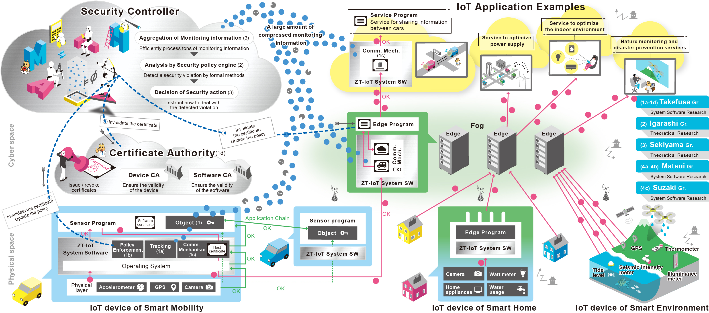

[\[Japanese\]](https://zt-iot.nii.ac.jp/)

<table>
  <tr>
    <td> <a href="#topics">Topics</a></td>
    <td> <a href="#overview">Overview</a></td>
    <td> <a href="#member">Members</a></td>
    <td> <a href="#publications">Publications</a></td>
  </tr>
</table>

# Zero Trust IoT by Formal Verification and System Software
CREST Research Area: [\[Society 5.0 System Software\] Creation of System Software for Society 5.0 by Integrating Fundamental Theories and System Platform Technologies](https://www.jst.go.jp/kisoken/crest/en/research_area/ongoing/area2021-2.html)

## Topics
- 2024/11 The ZT-IoT project is presented at the [SC24](https://sc24.supercomputing.org/)  in Atlanta. [Link](https://ccrd.nii.ac.jp/sc24/)
- 2023/11/11 The ZT-IoT project is presented at the [SC23](https://sc23.supercomputing.org/) Exhition Booth #256 in Denver. [Link](https://ccrd.nii.ac.jp/sc23/)
- 2022/11/01 The ZT-IoT project is presented at the [SC22](https://sc22.supercomputing.org/) Exhition Booth #4205 in Dallas. [PDF](https://drive.google.com/file/d/1SXcRYDSkcyxqTAewuJm5YerkvJG_13ss/view?usp=sharing)

## Research Outline
This project aims to realize secure Internet of Things (IoT) systems in accordance with the concept of zero trust by the fusion of formal verification and system software technologies.
In the formal verification research, we provide mathematical proofs for the legitimacy of IoT trust chains and address unknown threats combining static and dynamic verification.
In the system software research, we develop mechanisms for isolated execution, automatic detection, and automatic countermeasure in conjunction with the theoretical results in order to demonstrate zero trust IoT.
We also promote social acceptance of IoT by ensuring the accountability.

## Members
### Takefusa Gr.
- [Atsuko Takefusa](https://researchmap.jp/takefusa?lang=en) (Research Director), Professor,
  Information Systems Architecture Sciences Research Division,
  [National Institute of Informatics](https://www.nii.ac.jp/en/)
- [Yutaka Ishikawa](https://researchmap.jp/yutaka_ishikawa?lang=en), Professor,
  Information Systems Architecture Sciences Research Division,
  National Institute of Informatics
- [Kento Aida](https://researchmap.jp/aida?lang=en), Professor,
  Information Systems Architecture Sciences Research Division,
  National Institute of Informatics
- [Sayako Shimizu](https://researchmap.jp/smzs?lang=en), Assistant Professor,
  Information Systems Architecture Sciences Research Division,
  National Institute of Informatics
- [Naoya Kitagawa](https://researchmap.jp/7000026496?lang=en), Project Associate Professor,
  Research and Development Center for Academic Networks,
  National Institute of Informatics
- [Kumiko Kobayashi](https://researchmap.jp/kobayashikumiko?lang=en), Project Researcher,
  Center for Cloud Research and Development, National Institute of Informatics
- [Eisaku Sakane](https://researchmap.jp/sakaneeisaku?lang=en), Associate Professor,
  Information Systems Architecture Sciences Research Division,
  National Institute of Informatics
- [Takeshi Nishimura](https://researchmap.jp/nishimuratakeshi?lang=en), Project Researcher,
  Cyber Science Infrastructure Development Department, National Institute of Informatics
- Jie YIN, Project Researcher,
  Information Systems Architecture Sciences Research Division,
  National Institute of Informatics
- Nobuo Aoki, Doctoral Student,
  Informatics Program, Department of Advanced Studies, Graduate Institute for Advanced Studies,
  [The Graduate University For Advanced Studies (SOKENDAI)](https://www.soken.ac.jp/en/)

### Igarashi Gr.
- [Atsushi Igarashi](https://researchmap.jp/Atsushi.Igarashi?lang=en) (Collaborator), Professor,
	Department of Informatics,
	Graduate School of Informatics, [Kyoto University](https://www.i.kyoto-u.ac.jp)
- [Kohei Suenaga](https://researchmap.jp/ksuenaga?lang=en), Assoc. Professor,
	Department of Informatics,
	Graduate School of Informatics, Kyoto University
- [Masaki Waga](https://researchmap.jp/mwaga?lang=en), Assistant Professor,
	Department of Informatics,
	Graduate School of Informatics, Kyoto University
- [Sewon Park](https://researchmap.jp/sewonpark), Program-Specific Researcher,
    Department of Informatics,
	Graduate School of Informatics, Kyoto University
- Jin Takumi, Master's Student,
	Department of Informatics,
	Graduate School of Informatics, Kyoto University
- [Nishida Yuki](https://researchmap.jp/yuki-nishida)，Program-Specific Researcher,
    Department of Informatics,
	Graduate School of Informatics, Kyoto University (to Apr., 2024)
- Terunobu Inaba, Master's Student,
	Department of Communications and Computer Engineering,
	Graduate School of Informatics, Kyoto University (to Oct., 2024)
- Shi Zhen, Master's Student,
	Department of Communications and Computer Engineering,
	Graduate School of Informatics, Kyoto University (to Mar., 2024)
- Yuhi Sakaguchi, Master's Student,
	Department of Communications and Computer Engineering,
	Graduate School of Informatics, Kyoto University (to Mar., 2024)

### Sekiyama Gr.
- [Taro Sekiyama](https://researchmap.jp/t-sekiym?lang=en) (Collaborator), Assoc. Professor,
	Information Systems Architecture Sciences Research Division,
	[National Institute of Informatics](https://www.nii.ac.jp/en/)
- [Fuyuki Ishikawa](https://researchmap.jp/f-ishikawa?lang=en), Associate Professor,
	Information Systems Architecture Sciences Research Division,
  National Institute of Informatics
- [Shin-ya Katsumata](https://researchmap.jp/shinya_katsumata?lang=en), Project Associate Professor,
	Information Systems Architecture Sciences Research Division,
  National Institute of Informatics
- [Ichiro Hasuo](https://researchmap.jp/read0136635?lang=en), Professor,
	Information Systems Architecture Sciences Research Division,
  National Institute of Informatics
- [Kensuke Fukuda](https://researchmap.jp/kensuke/), Professor,
	Information Systems Architecture Sciences Research Division,
  National Institute of Informatics
- Nakabayashi Misato, Doctoral Student,
	Department of Informatics, School of Multidisciplinary Sciences,
  [The Graduate University For Advanced Studies (SOKENDAI)](https://www.nii.ac.jp/graduate/en/)
- Ryusei Siiba, Doctoral Student,
	Department of Informatics, School of Multidisciplinary Sciences,
  The Graduate University For Advanced Studies (SOKENDAI)
- Kenji Taguchi(by Mar. 2022), Project Researcher,
	Information Systems Architecture Sciences Research Division,
  National Institute of Informatics
- Lelio Brun, Project Researcher,
	Information Systems Architecture Sciences Research Division,
  National Institute of Informatics
- Hiroya Fujinami, Doctoral Student,
	Department of Informatics, School of Multidisciplinary Sciences,
  The Graduate University For Advanced Studies (SOKENDAI)

### Matsui Gr.
- [Toshihiro Matsui](https://www.tid.ac.jp/contents/professor/toshihiro-matsui/) (Collaborator), Professor,
	Information Design Division, [Tokyo Information Design Professional University](https://www.tid.ac.jp/)
- Ono Yasushi, Project Research Assistant,
	Information Design Division, Tokyo Information Design Professional University
- Rika Wakatsuki, Project Research Assistant,
	Information Design Division, Tokyo Information Design Professional University

### Suzaki Gr.
- [Kuniyasu Suzaki](https://www.iisec.ac.jp/education/professors/suzaki.html) (Collaborator), Professor,
	Graduate School of Information Security, [Institute of Information Security](https://www2.iisec.ac.jp/english/)
- Ono Yasushi, Project Research Assistant,
	Graduate School of Information Security, Institute of Information Security
- Rika Wakatsuki, Project Research Assistant,
	Graduate School of Information Security, Institute of Information Security

## Publications

### FY 2024
- [Paper] Terunobu Inaba, Yutaka Ishikawa, Atsushi Igarashi, Taro Sekiyama, Rabbit: A Language to Model and Verify Data Flow in Networked Systems, Proc. the 11th International Symposium on Networks, Computers and Communications (ISNCC'24).
- [Paper] Masaki Waga, Kotaro Matsuoka, Takashi Suwa, Naoki Matsumoto, Ryotaro Banno, Song Bian, Kohei Suenaga Oblivious Monitoring for Discrete-Time STL via Fully Homomorphic Encryption, Proc. The 24th International Conference on Runtime Verification (RV 2024).
- [Paper] Taro Sekiyama, Hiroshi Unno, Higher-Order Model Checking of Effect-Handling Programs with Answer-Type Modification, Proc. the ACM on Programming Languages (PACMPL).

- [Paper] Atsuya Osaki, Manuel Poisson, Seiki Makino, Ryusei Shiiba, Kensuke Fukuda, Tadashi Okoshi, Jin Nakazawa, Dynamic Fixed-point Values in eBPF: a Case for Fully In-kernel Anomaly Detection, Proc. AINTEC 2024, pp. 46-54, Aug. 2024. [doi: 10.1145/3674213.3674219](https://doi.org/10.1145/3674213.3674219)
- [Paper] Manuel Poisson, Rodrigo Carnier, Kensuke Fukuda, GothX: a generator of customizable, legitimate and malicious IoT network traffic, Proc. CSET 2024, pp. 65-73, Aug. 2024. [doi: 10.1145/3675741.3675753](https://doi.org/10.1145/3675741.3675753)
- [Paper] Jie Yin, Yutaka Ishikawa, Atsuko Takefusa, A Linux Audit and MQTT based Monitoring Framework for IoT Devices and Its Evaluation, IPSJ Journal special issue of “Applications and the internet” in conjunction with the main topics of COMPSAC 2023, vol. 65, no. 8, pp. 586-595, Aug. 2024. [doi: 10.2197/ipsjjip.32.586](https://doi.org/10.2197/ipsjjip.32.586)
- [Paper] Yuye Uezato, Regular Expressions with Backreferences and Lookaheads Capture NLOG, Proc. the 51st International Colloquium on Automata, Languages, and Programming (ICALP), vol. 297, no. 155, pp. 1-20, Jul. 2024. [doi: 10.4230/LIPICS.ICALP.2024.155](https://doi.org/10.4230/LIPICS.ICALP.2024.155)
- [Paper] Takashi Yagawa, Tadanori Teruya, Kuniyasu Suzaki, Hirotake Abe, Delegating Verification for Remote Attestation using TEE, Proc. IEEE European Symposium on Security and Privacy Workshops (EuroS&PW), pp. 186-192, Jul. 2024. [doi: 10.1109/EuroSPW61312.2024.00025](https://doi.org/10.1109/EuroSPW61312.2024.00025)
- [Paper] Chisa Ito, Atsuko Takefusa, Hidemoto Nakada, Masato Oguchi, Communication Performance Evaluation Using Compression Processing for IoT Systems in Mobile Environments, Proc. IEEE COMPSAC 2024, SIS-SS, pp. 2374-2379, Jul. 2024. [doi: 10.1109/COMPSAC61105.2024.00380](https://doi.org/10.1109/COMPSAC61105.2024.00380)
- [Paper] Misato Nakabayashi, Taro Sekiyama, Ichiro Hasuo, Yutaka Ishikawa, Formal Support for Threat Modeling with Attack Decision Diagrams, Proc. the 18th IEEE International Workshop on Security, Trust, and Privacy for Software Applications, pp. 2454-2459, Jul. 2024. [doi: 10.1109/COMPSAC61105.2024.00394](https://doi.org/10.1109/COMPSAC61105.2024.00394)
- [Paper] Nobuo Aoki, Atsuko Takefusa, Yutaka Ishikawa, Yasushi Ono, Eisaku Sakane, Kento Aida, ZT-OTA Update Framework for IoT Devices toward Zero Trust IoT, Proc. IEEE Computers, Software, and Applications Conference (COMPSAC 2024), NETSAP, pp. 2200-2207, Jul. 2024. [doi: 10.1109/COMPSAC61105.2024.00352](https://doi.org/10.1109/COMPSAC61105.2024.00352)
- [Paper] Hiroya Fujinami, Ichiro Hasuo, Efficient Matching with Memoization for Regexes with Grouping, Proc. the 33rd European Symposium on Programming, pp. 90-118, Apr. 2024. [doi: 10.1007/978-3-031-57267-8_4](https://doi.org/10.1007/978-3-031-57267-8_4)
- [Poster] Atsuko Takefusa, Yutaka Ishikawa, Yasushi Ono, Design of Trust Chained IoT Key Management using OP-TEE, USENIX OSDI '24, Poster, Jul. 2024.

### FY 2023
- [Invited Talk] Atsuko Takefusa, System Software Studies towards Zero Trust IoT (ZT-IoT), Cloud-edge Fusion (CEF) Symposium, CENTRA 7, Feb. 2024.
- [Paper] Taichi Takemura, Ryo Yamamoto, Kuniyasu Suzaki, TEE-PA: TEE Is a Cornerstone for Remote Provenance Auditing on Edge Devices With Semi-TCB, IEEE ACCESS, vol. 12, pp. 26536-26549, Feb. 2024. [doi: 10.1109/ACCESS.2024.3366344](https://doi.org/10.1109/ACCESS.2024.3366344)
- [Paper] Uyen Do, Laura Lahesoo, Rodrigo Matos Carnier, Kensuke Fukuda, Evaluation of XAI Algorithms in IoT Traffic Anomaly Detection, Proc. the 6th International Conference on Artificial Intelligence in Information and Communication, pp. 669-674, Feb. 2024. [doi: 10.1109/ICAIIC60209.2024.10463357](https://doi.org/10.1109/ICAIIC60209.2024.10463357)
- [Paper] Fuga Kawamata, Hiroshi Unno, Taro Sekiyama, Tachio Terauchi, Answer Refinement Modification: Refinement Type System for Algebraic Effects and Handlers, Proc. the ACM on
Programming Languages, pp. 115-147, Jan. 2024. [doi 10.1145/3633280](https://doi.org/10.1145/3633280)
- [Paper] Laura Lahesoo, Uyen Do, Rodrigo Carnier, Kensuke Fukuda, SIURU: A Framework for Machine Learning Based Anomaly Detection in IoT Network Traffic, Proc. the 18th Asian Internet Engineering Conference, pp. 87-95, Dec. 2023. [doi: 10.1145/3630590.3630601](https://doi.org/10.1145/3630590.3630601)
- [Exhibition] Zero Trust based IoT Security, SC23 Exhibition Booth #256, Nov. 2023． [Link](https://ccrd.nii.ac.jp/sc23/)
- [Paper] Lélio Brun, Ichiro Hasuo, Yasushi Ono and Taro Sekiyama, Automated Security Analysis for Real-World IoT Devices. Proc. HASP '23: Hardware and Architectural Support for Security and Privacy, pp 29-37, Oct. 2023. [doi: 10.1145/3623652.3623667)](https://doi.org/10.1145/3623652.3623667)
- [Invited Talk] Taro Sekiyama, Answer-Refinement Modification: A refinement type system for algebraic effect handlers, Shonan Meeting No.203 (Effect Handlers and General-Purpose Languages), Aug. 2023.
- [Paper] Jie Yin, Yutaka Ishikawa, Atsuko Takefusa, A Linux Audit and MQTT- based Security Monitoring Framework, Proc. IEEE COMPSAC 2023, pp. 648-657, Jun. 2023.
- [Paper] Taro Sekiyama, Unno Hiroshi, Temporal Verification with Answer-Effect Modification: Dependent Temporal Type- and-Effect System with Delimited Continuations, Proceedings of the ACM on Programming Languages (POPL), 7, POPL, pp. 2079-2110, Apr. 2023. [doi: 10.1145/3571264](https://doi.org/10.1145/3571264)

### FY 2022
- [Poster] Sayako Shimizu, Eisaku Sakane, Takeshi Nishimura, Kento Aida, Atsuko Takefusa,
Certification Mechanism to Assure Software Reliability with Digital Signature,
International Symposium on Grids & Clouds (ISGC), Mar. 2023.
- [Invited Talk] Atsuko Takefusa, Building System Software for Zero Trust IoT (ZT-IoT). Secure Device Forum 2023, Feb. 2023 (Keynote)
- [Invited Talk] Atsushi Igarashi, (I Can't Get No) Verification,
ACM SIGPLAN International Conference on Systems, Programming, Languages, and Applications (SPLASH), Dec. 2022. (Keynote) [Link](https://dl.acm.org/doi/abs/10.1145/3563768.3570524)
- [Exhibition] Zero Trust based IoT Security, SC22 Exhibition Booth #4205, Nov. 2022． [PDF](https://drive.google.com/file/d/1SXcRYDSkcyxqTAewuJm5YerkvJG_13ss/view?usp=sharing)
- [Paper] Naoya Kitagawa, Atsuko Takefusa, Kento Aida, Development of a Secure Data Sharing Mechanism for IoT Application Systems, Proc. 2022 IEEE 11th International Conference on Cloud Networking (CloudNet), pp. 131-135, Nov. 2022. [doi: 10.1109/CloudNet55617.2022.9978835](https://doi.org/10.1109/CloudNet55617.2022.9978835)
- [Paper] Ryotaro Banno, Kotaro Matsuoka, Naoki Matsumoto, Song Bian, Masaki Waga, Kohei Suenaga, Oblivious Online Monitoring for Safety LTL Specification via Fully Homomorphic Encryption, Lecture Notes in Computer Science (Computer Aided Verification), 13371, pp. 447-468, Aug. 2022. [Link](https://link.springer.com/chapter/10.1007/978-3-031-13185-1_22)
